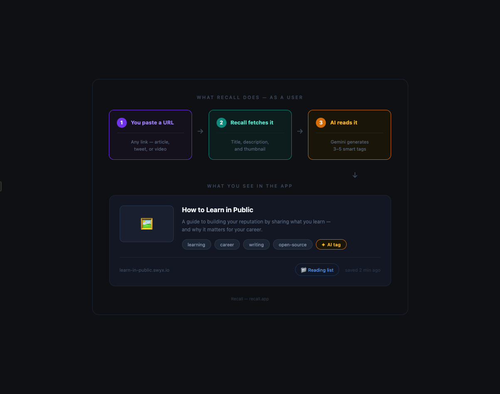
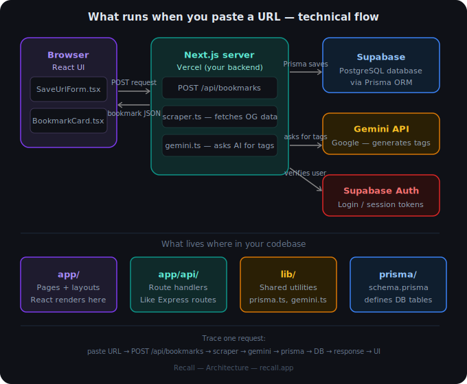
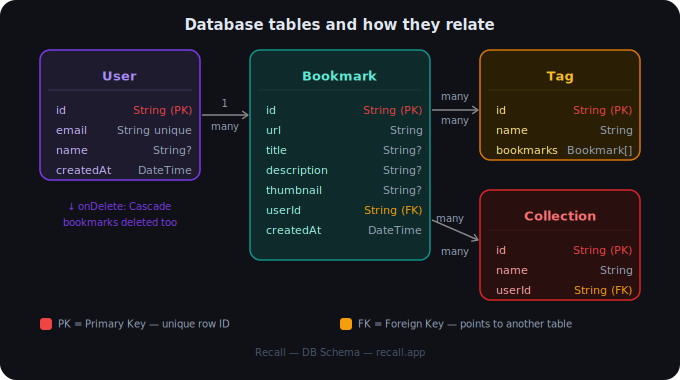

# Recall

[](https://coderabbit.ai)

Save anything from the internet. Recall it with AI.

## How it works







## Features

**Built so far:**
- Paste any URL → auto-fetches title, description, and thumbnail
- Manual tag add/remove per bookmark
- Text search API across title, URL, and description

**Coming in Phase 1:**
- User authentication (login/register)
- Chrome extension (save, list, delete bookmarks from any page)

**Coming in Phase 2:**
- AI-generated tags (powered by Gemini)
- Collections (folders) for organizing bookmarks
- User and admin dashboards

## Tech Stack

- **Frontend + API** — Next.js 16 (App Router)
- **Styling** — Tailwind CSS
- **Database** — PostgreSQL via Supabase
- **ORM** — Prisma
- **AI Tagging** — Google Gemini API
- **Auth** — Supabase Auth
- **Deployment** — Vercel

## Getting Started

### Prerequisites

- Node.js 18+
- A [Supabase](https://supabase.com) project
- A [Gemini API key](https://aistudio.google.com/app/apikey)

### Setup

```bash
git clone https://github.com/MinitJain/recall.git
cd recall/client
npm install
```

Create a `.env.local` file inside `client/`:

```env
DATABASE_URL=your_supabase_postgres_connection_string
DIRECT_URL=your_supabase_direct_connection_string
NEXT_PUBLIC_SUPABASE_URL=your_supabase_project_url
NEXT_PUBLIC_SUPABASE_ANON_KEY=your_supabase_anon_key
GEMINI_API_KEY=your_gemini_api_key
RECALL_API_KEY=some_long_random_secret
```

```bash
npx prisma generate
npx prisma db push
npm run dev
```

App runs at `http://localhost:3000`

## Roadmap

**Phase 1 (in progress)**
- Supabase Auth (login/register)
- Chrome extension — floating save button, popup, cross-browser sync via same account
- Bookmarklet — backup for any browser, no extension required

**Phase 2**
- User dashboard and admin dashboard
- AI-generated tags (Gemini)
- Collections/folders
- Resurfacing — surface older bookmarks with matching tags

**Phase 3**
- Semantic / vector search (find similar bookmarks by meaning)
- D3.js knowledge graph — visualize bookmarks and tags as a graph
- Background queue workers for async AI tagging

## License

MIT
